# Arduino Steering Wheel Control for after market Jensen Radio in a 2008 VW Rabbit

Added an aftermarket Jensen radio to a 2008 VW Rabbit.  The Jensen radio supports steering wheel control input via a 3.5 mm stereo 3 pole plug.  There is some documentation in the radio's [user manual](https://jensenmobile.com/wp-content/uploads/2022/05/J1CA7W-OM-EN-20210820.pdf) (see page 27 in the link) about how the control signals are to be set.  
## How do steering wheel controls work?
Steering Wheel Controls - commonly called SWC's - are a pretty old technology that was created by car manufacturers probably in the 70's and 80's.  They use a technique called a [resistor ladder](https://electronics.stackexchange.com/questions/331661/resistor-ladder-with-same-resistor-value-and-different-resistor-value) to reduce the number of wires that need to run from the steering wheel to the radio.  The buttons on the steering wheel short out a given resistor reducing the overall resistance of the circuit.  The radio interprets the change in voltage caused by the resistance change as a button press and responds accordingly.  The use of resistor ladders with switches is very common with consumer electronics.  Here's an example schematic from a 2006 Ford Five Hundred:
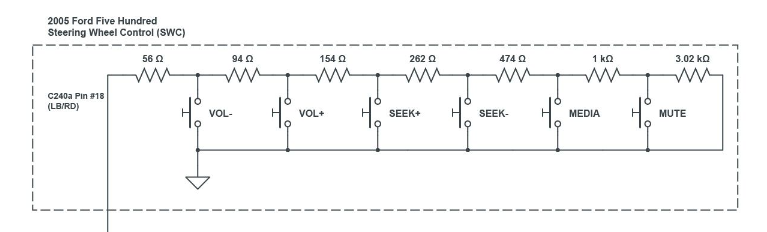

Later model cars are more likely to use a digital network in the car to handle controls and not a ladder.  These networks also reduce the number of wires - most devices in a car now just use 4 wires - power (+ and -) and two wires for data.  

## The basic problem with the Jensen radio
The Jensen radio is designed for working with resistor ladders.  Unfortunately, there was no single industry standard on the values used for the various functions.  So there are third party devices like the PAC SWI-RC that are programmable and can convert the values used by the car to the values needed by the radio.

The Jensen radio provides a 3.5 mm jack to be used for the SWC interface with the following specifications: 
1.  Sleeve - Ground.  The Ring and Tip voltages are relative to this ground.
1.  Ring - indicates mode, and has values of either 3.3V or 0V.  0V is for phone functions - answer phone, hangup phone, use phone voice feature (Google Assistant or Siri) and 3.3V for all media control functions
1.  Tip - variable voltage to indicate what function is to be executed (table below).

There are many wireless button kits available that can be used to add steering wheel audio controls.  The kits usually contain two wireless button controllers that can be added to the steering wheel, and a very small module what takes in 12V power and outputs either one or two wires for the output signals.  I used this one from [Amazon](https://www.amazon.com/dp/B07DFG7MRT?psc=1&ref=ppx_yo2ov_dt_b_product_details).  It is intended to be used with generic Android based car stereo units. It looks like this:

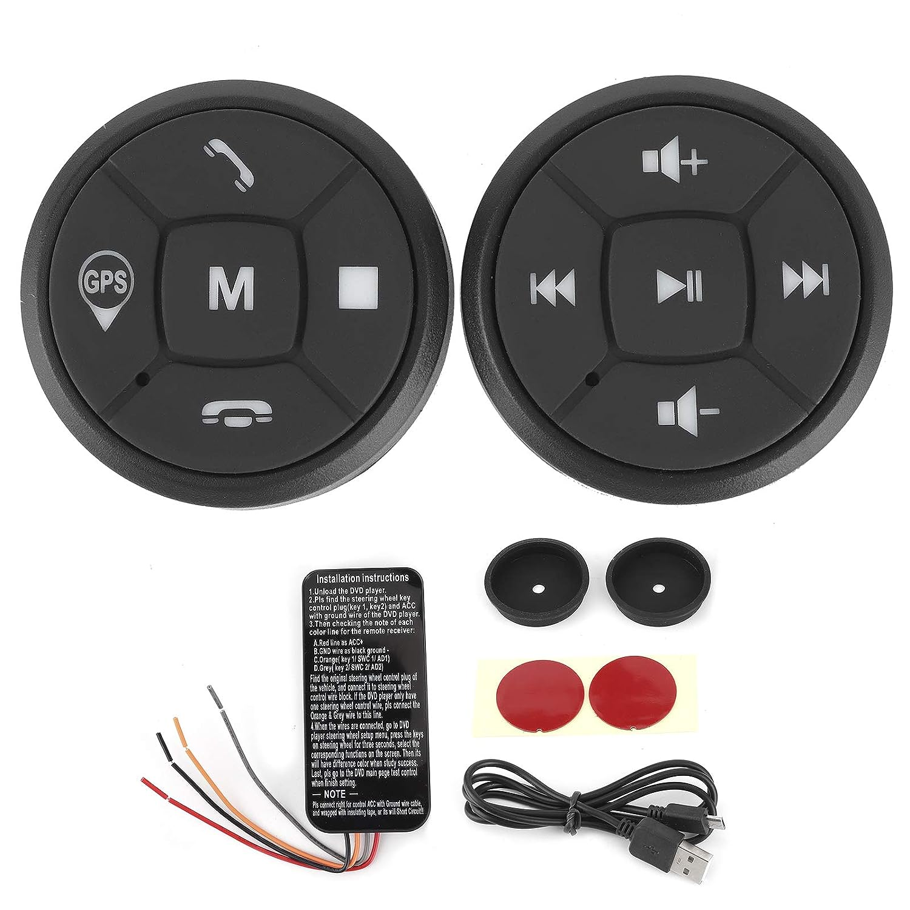
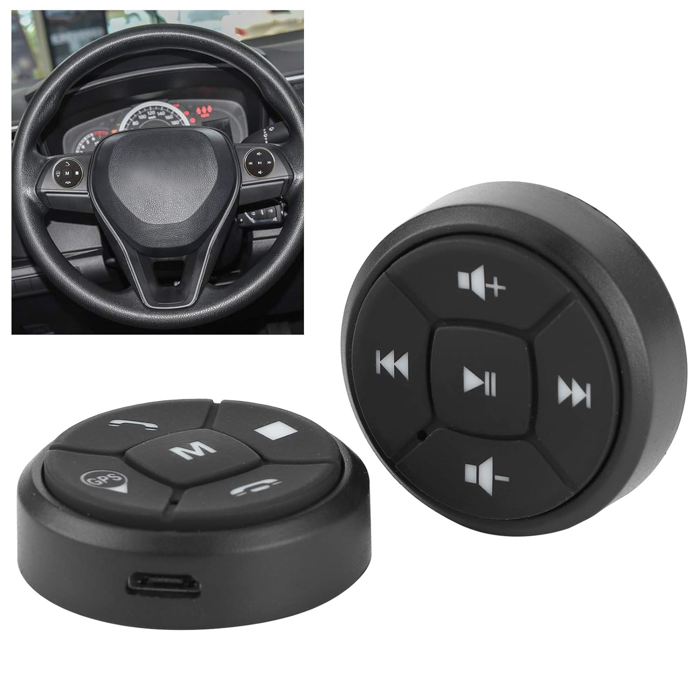
This item uses rechargeable batteries and has a micro-usb port on the buttons to charge the batteries.  They are mounted in soft rubber cups so they can be removed to be charged.  Other designs use coin batteries and may use a magnetic base for holding the buttons.

The protocol used by the buttons does NOT match the protocol used by the Jensen radio.  From the user manual it states to use settings compatible with "Pioneer/Other/Sony" with a PAC SWI-RC controller.  The wireless button controllers use some kind of protocol specific to Android Automotive (a version of Android that is optimized for car head units).  I have not been able to find any documentation on THAT standard, but I was able to use an oscilloscope and capture the voltage values that are output when you put a 3.3V reference voltage on the output wires:
| Button  | Key1 Wire | Key2 Wire |
| :-------------------- | :--------------------: | :--------------------: |
|Vol+|0.255|
|Vol-||0.813
|Trk<|0.779|
|Trk>||1.56
|Pause|0.16|
|Phone+||0.02
|Phone-|0.077|
|Mute||1.29
|Stop|0.615|
|GPS||2.28

From page 27 in the Jensen radio manual we can see the values that we need to map to:
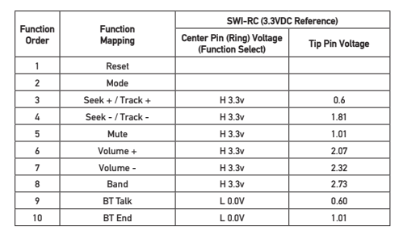
So, the Jensen radio expects two wires - one with a either 0V or 3.3V to select a function (Bluetooth control versus media control) and the other with voltages varying from 0.6 to 2.73 volts. The button controls have two wires with different voltages indicating the media or phone control function.

## Interfacing between the buttons and the Jensen radio
Clearly a bridge controller is needed to handle the different specs of the buttons and the radio.  It wasn't clear if the commercial PAC SWI-RC module could handle this combination, or how much it would cost to get the custom program that the vendor sells for special cases.  So I've decided to make my own controller using an ESP32-S2 Microprocessor Control Unit (MPU) module.

The ESP32-S2 has both analog-to-digital (ADC) and digital-to-analog (DAC) capabilities.  An ADC will be used to measure the voltages from the button controller module and convert them to a digital value that represents the button pressed, and a DAC will be used to generate the correct output voltage for the radio based on which button was detected via the ADC.

## Testing out the concept
I built a test bed using a breadboard,  [ESP32-S2 development module](https://www.amazon.com/gp/product/B0B97K3LJQ/ref=ppx_yo_dt_b_search_asin_image?ie=UTF8&psc=1), [LCD display](https://www.amazon.com/gp/product/B07MTFDHXZ) and a [rotary encoder](https://www.amazon.com/gp/product/B07F26CT6B):
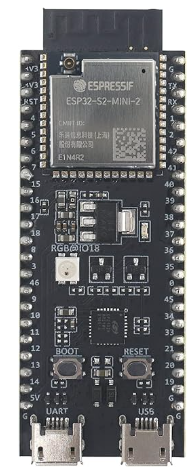 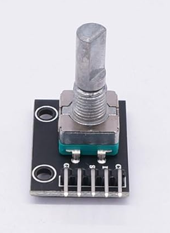 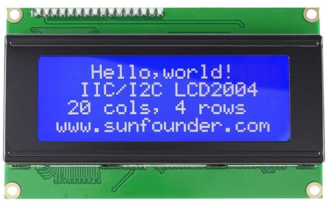

The source code for this is located in another [Github repository](https://github.com/edleno2/ProgramSWControl).  This test bed allows me to try out various output voltages to see how the Jensen radio reacts, and to determine the digital value to use with the DAC to generate the correct voltage.  A sample user interface from the LCD display looks like:

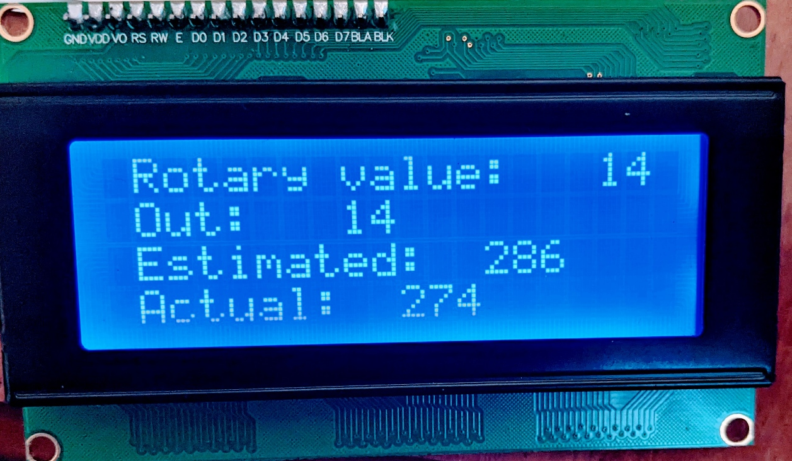 
The Rotary value and the Estimated value change as you rotate the encoder.  The Out and Actual values are displayed when you press the button on the encoder's knob.  The DAC works by providing a value from 0 to 255 in the software and the DAC outputs a voltage between 0.2V and 2.8V.  The Actual value is measured from another ADC pin that is connected to the DAC pin to record the voltage that is output for the given Out value sent to the DAC.  

A pull down resistor of 270 ohms was added from the DAC pin to ground in order to get the DAC to pull down to lower values. 

By using the test bed I was able to determine that range of voltages that the Jensen radio will interpret for each control function.  In addition I found a few additional functions:
- Fast Forward: Move forward in the current media file
- Rewind: Move backward in the current media file
- Menu: Navigate to the radio's menu display
- Voice: Activate the voice assistant of Android Auto (Google Assistant) or Apple Carplay (Siri)

Using the test bed I determined the following ranges for the variable output voltages and selected an "Out value" that was near the center of the range.  All of the Tip voltage values are in millivolts(mv):
| Button  | Tip Low | Tip High | Ring | Out Value |
| :-------------------- | :--------------------: | :--------------------: | :--------------------: | --------------------: | 
|Vol+|1981|2225|3.3|165
|Vol-|2237|2482|3.3|190
|Trk<|1945|1968|3.3|155
|Trk>|1657|1695|3.3|132
|Voice (Pause)|?|2628|0|221
|Phone+|?|606|0|41
|Phone-|?|1098|0|83 
|Mute|999|1005|3.3|75
|Band (Stop)|?|2628|3.3|221
|Menu (GPS)|592|595|3.3|40
|Forward (n/a)|1540|1544|3.3|120
|Reverse (n/a)|1823|1829|3.3|145

? = I failed to document a few of the ranges

I mapped the Voice function to the Pause button, the Band function to the Stop button, and the Menu function to the GPS button (the radio doesn't have any of those functions anyway).  I left out the undocumented Forward and Reverse functions.
## Issues with the Jensen radio remote steering wheel controls
One issue with the Jensen radio is a decision that was apparently made by the manufacturer.  When in radio mode the Trk< and Trk> buttons change the frequency of the radio and do NOT go to the next or previous preset for the radio.  This is pretty much against EVERY other radio out there.  I mean, once you set the preset frequencies you never need to change a frequency again.

The ranges for the "modern" media (Forward, Reverse, Trk<, Trk>, Mute) are much smaller than the "legacy" values for things like volume.  The designers had to work around the legacy values and squeeze the modern values wherever they would fit in the voltage ranges.  At times the Trk< button will trigger a Vol+ because the ranges are so close. 
## Design
Circuit diagram of the ESP32-S2 Dev module (a Lolin Mini-S2 clone) with the 12-to-5v buck converter module:

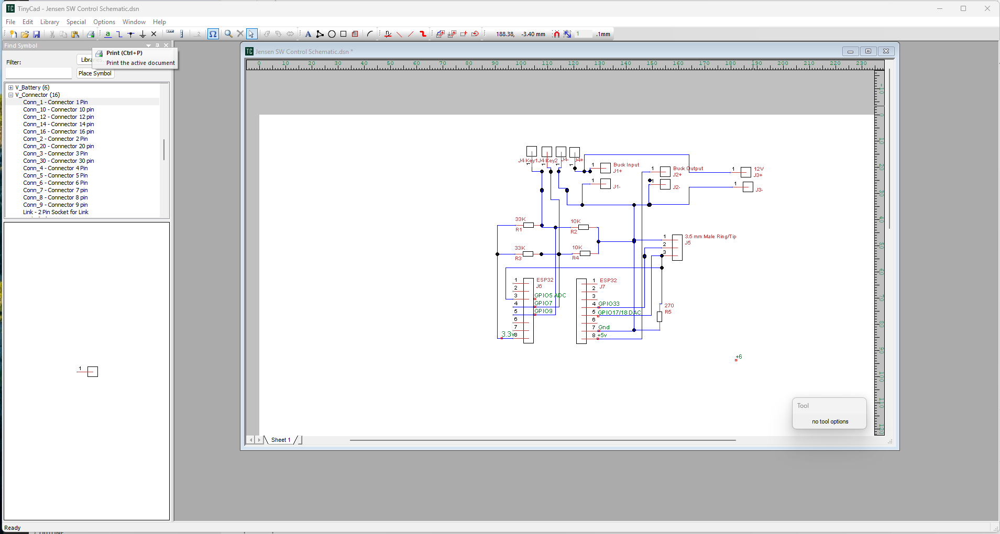

Prototype PCB board (partial) design in VeeCad:

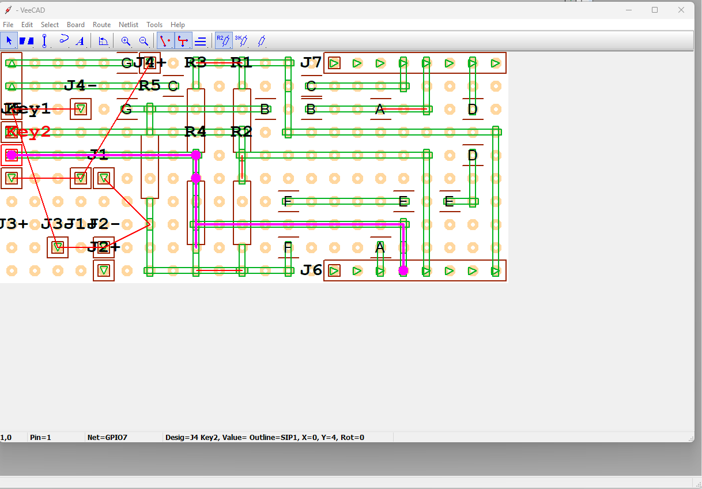

The boards will be housed in a custom 3D printed enclosure.  This was designed using Autodesk Fusion 360 and printed on an Ender 3 SI printer.  There are two rails included in the internal structure to hold the two circuit boards. The design looks like:

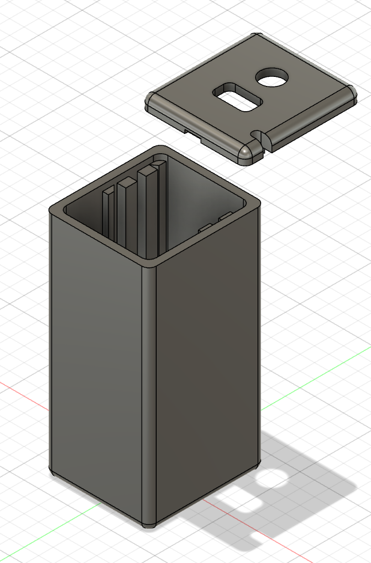
## Construction
The circuit board from the button controller has been removed from its enclosure so it can be put in a new enclosure with the ESP32 module.  

The ESP32 module is mounted on a 30x70mm double sided copper clad prototype PCB board.  Wiring is done with (mostly) bare 30 AWG wire.  Here are some photos of the new assembly:

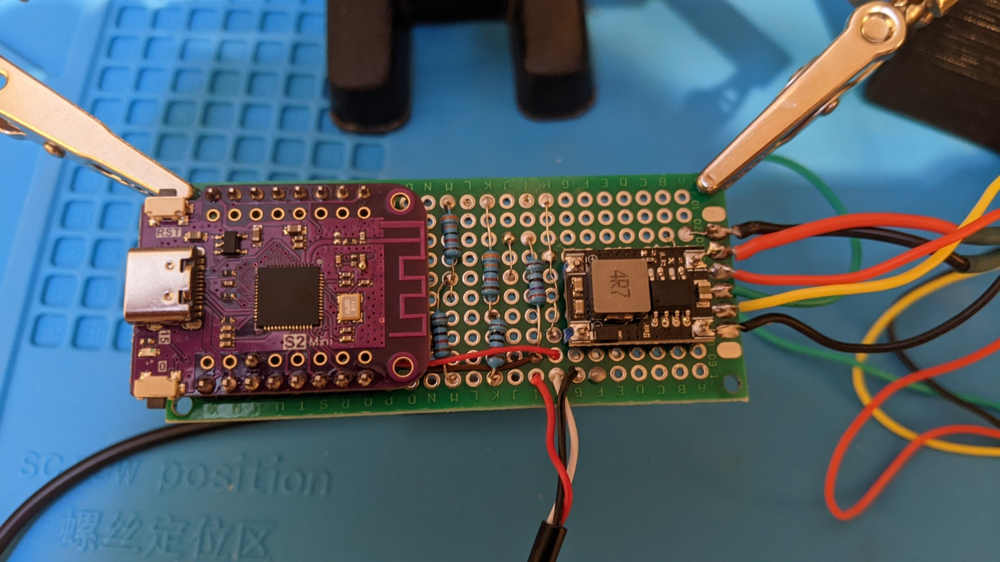 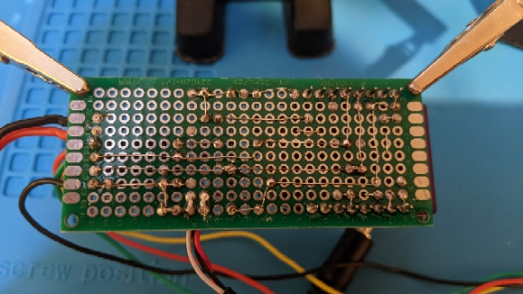 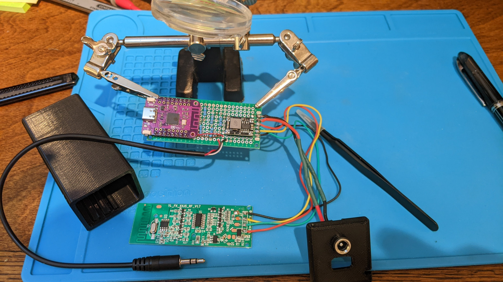

Here are the two circuit boards mounted in the rails of the enclosure.  The "third" board is the dev module of the ESP32 which is actually mounted on the custom prototype PCB:

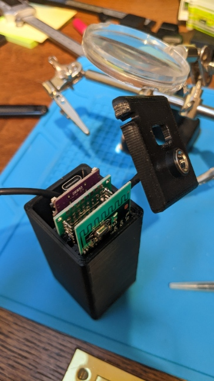 

The completed assembly:

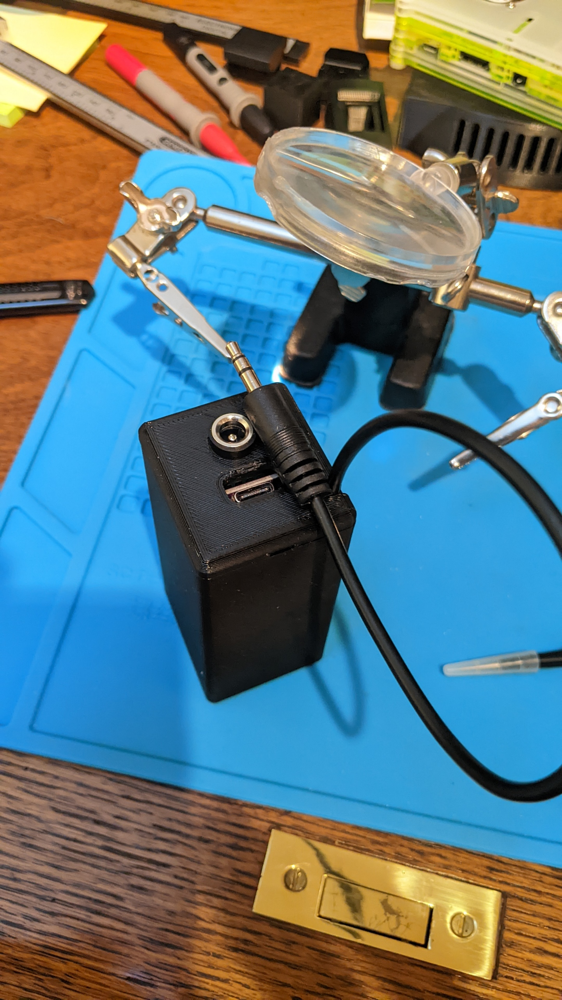
## Final Installation
Here are the button controls installed in the steering wheel of the 2008 VW Rabbit.  The urethane foam of the steering wheel was cut with an Exacto knife and then routed out with a Dremel tool and die grinder bits:

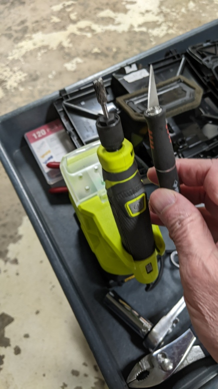 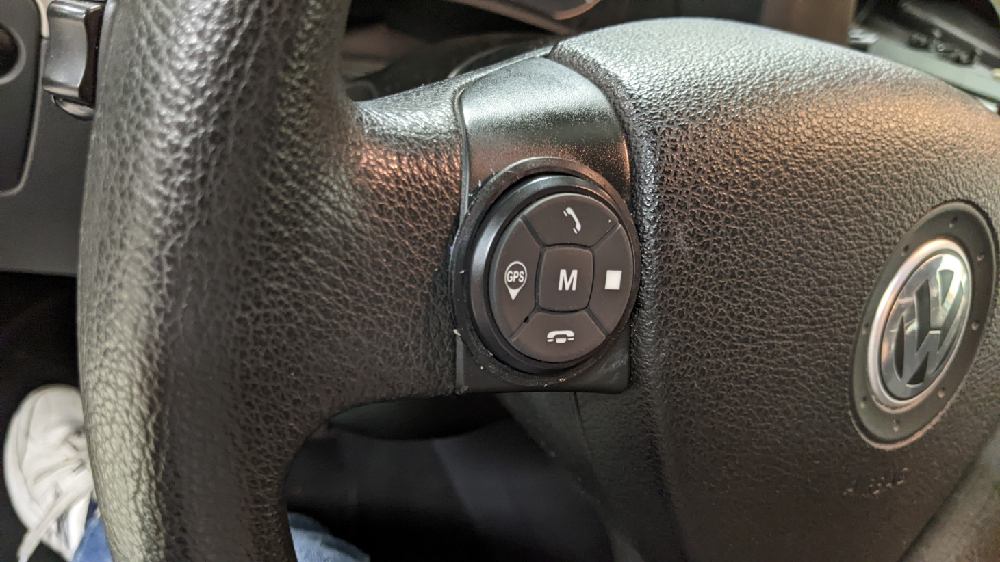 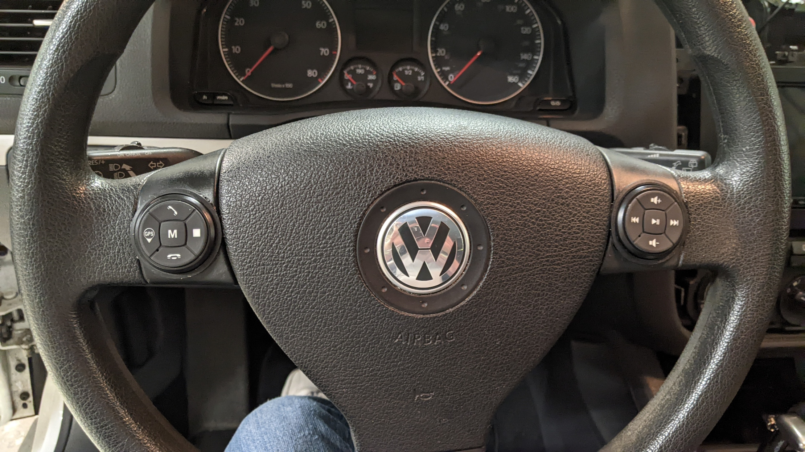

Radio installed in dash.  A [Scosche Dual DIN kit](https://www.amazon.com/gp/product/B01NCJ2UE2) for the VW Rabbit was used:

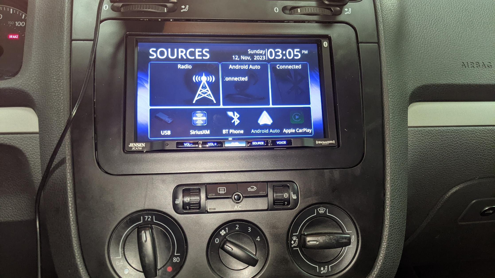

## Final notes

This project took around 20 days to complete.  The date was driven by my grandsons' 16th birthday when we are going to gift the car to our daughter as the "kids car" along with the new radio.  A backup camera was also added to the back of the Rabbit and is integrated with the Jensen radio:

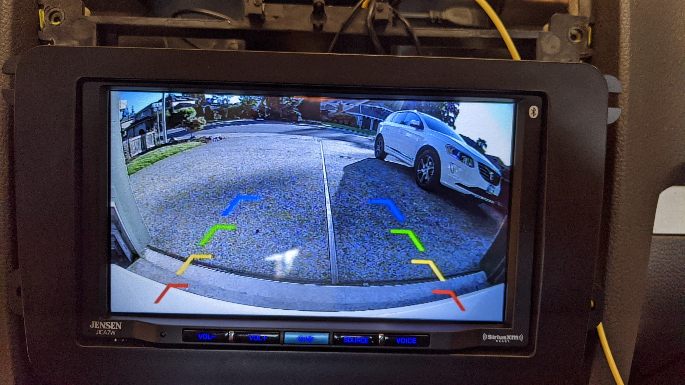 

As installed on the back hatch (blue tape is for alignment):

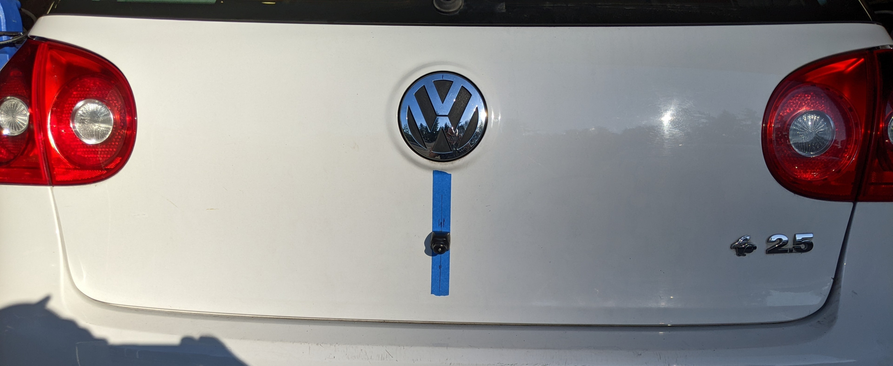 

The Jensen radio also provides a USB interface for either media or for Android Auto or Apple Carplay.  A custom USB mount was 3D printed to fit into the cars center console:

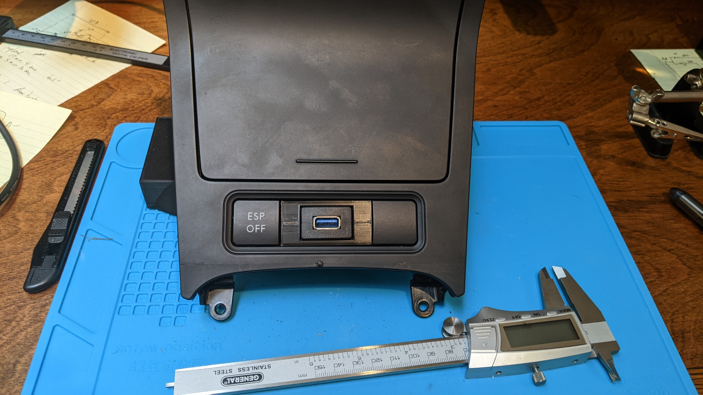